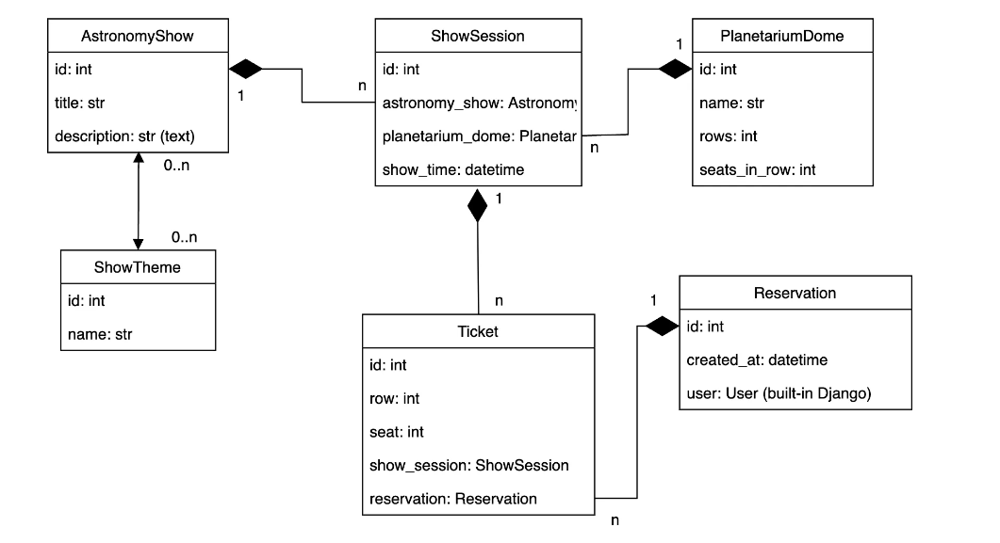
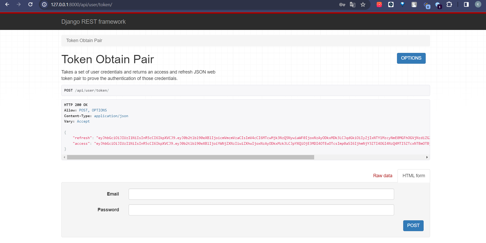
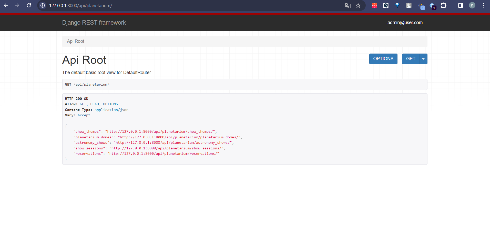
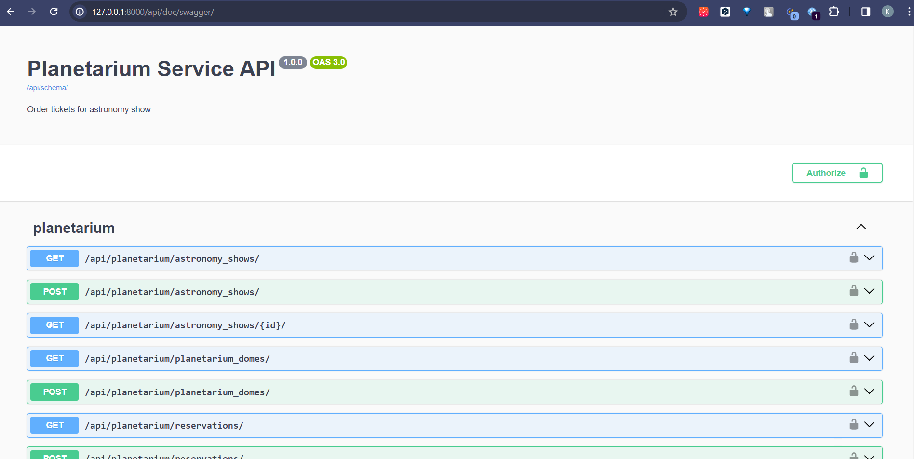

# Planetarium service API

## Description
API service for planetarium management written on DRF

## Installing using GitHub
Install PostgresSQL and create db
```
cd path/to/your/directory
git clone https://github.com/katyakoziar/planetarium_api_service
python -m venv venv
```
   - for Windows:
   ```
   .\venv\Scripts\activate
   ```
   - for Linux/Mac:
   ```angular2html
   source venv/bin/activate
```
```
pip install requirements.txt

set DB_HOST=db
set DB_NAME=db
set DB_USER=postgres
set DB_PASSWORD=userpassword
set SECRET_KEY=django-insecure-a7h41qq#&!y^$77i)t@dh#=xx9wdzc846w239cc&zwg1br9jb9

python manage.py migrate
pythom manage.py runserver
```

## Run with docker
Docker should be installed

```
docker-compose build
docker-compose up
```

## Getting access
- [Create user](http://127.0.0.1:8000/api/user/register/)
- [Get access token](http://127.0.0.1:8000/api/user/token/)




